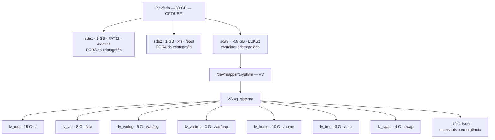

# INSTALL.md — Instalação segura do Red Hat Enterprise Linux

Guia reproduzível · Grupo 6 · CP02 Sistemas Operacionais Linux — FIAP

Este documento permite que outra pessoa, partindo de um hipervisor vazio, chegue exatamente ao mesmo ambiente: RHEL com **LVM sobre LUKS2**, partições separadas com opções restritivas, SELinux em Enforcing e serviço SSH endurecido.

**Tempo estimado:** 3h30 (1h de instalação, o resto de configuração e validação)

---

## Sumário

- [0. Antes de começar](#0-antes-de-começar)
- [1. Preparo da mídia](#1-preparo-da-mídia)
- [2. Criação da máquina virtual](#2-criação-da-máquina-virtual)
- [3. Esquema de particionamento](#3-esquema-de-particionamento)
- [4. Instalação](#4-instalação)
- [5. Primeiro boot e validação](#5-primeiro-boot-e-validação)
- [6. Registro da subscrição](#6-registro-da-subscrição)
- [7. Opções de montagem](#7-opções-de-montagem)
- [8. Segundo disco e ciclo de vida do LVM](#8-segundo-disco-e-ciclo-de-vida-do-lvm)
- [9. Serviço SSH endurecido](#9-serviço-ssh-endurecido)
- [10. Script de auditoria](#10-script-de-auditoria)
- [11. Coleta de evidências](#11-coleta-de-evidências)
- [12. Troubleshooting](#12-troubleshooting)
- [Apêndice A — Valores usados pelo grupo](#apêndice-a--valores-usados-pelo-grupo)
- [Apêndice B — Recuperação](#apêndice-b--recuperação)

---

## 0. Antes de começar

### Convenções

| Notação | Significado |
|---|---|
| `#` | comando executado como root no servidor |
| `$` | comando executado como usuário comum |
| `(host)$` | comando executado na máquina física / cliente SSH |
| `<VALOR>` | substituir pelo valor do Apêndice A |

### Pré-requisitos

- Hipervisor com virtualização por hardware habilitada na BIOS/UEFI do host
- 60 GB livres em disco no host + 20 GB para o segundo disco
- Conta em `developers.redhat.com` com a Red Hat Developer Subscription ativa
- Cliente SSH no host (OpenSSH, incluso no Linux, macOS e Windows 10+)

### Três regras que não se negociam

1. **Anote a passphrase do LUKS.** Não existe recuperação. Sem passphrase e sem backup do header, o dado está perdido em definitivo.
2. **Tire snapshot nos pontos marcados 📸.** Você vai quebrar o ambiente.
3. **Nunca feche a sessão SSH atual** antes de validar a nova configuração em uma segunda sessão aberta em paralelo.

---

## 1. Preparo da mídia

1. Faça login em `developers.redhat.com` → *Downloads* → *Red Hat Enterprise Linux* → arquitetura **x86_64**, imagem **Binary DVD**.
2. Anote o SHA-256 publicado na página de download.
3. Verifique a integridade da imagem baixada:

```bash
(host)$ sha256sum <ARQUIVO_ISO>
```

**Saída esperada:** um hash idêntico, caractere a caractere, ao publicado pela Red Hat.

> 📁 Salve a saída em `evidencias/01-disco/00-hash-iso.txt`.

---

## 2. Criação da máquina virtual

Exemplo em VirtualBox. Para KVM/VMware, mantenha os mesmos parâmetros.

| Parâmetro | Valor | Local na interface |
|---|---|---|
| Nome | `rhel-grupo6` | Nova VM |
| Tipo / Versão | Linux / Red Hat (64-bit) | Nova VM |
| Memória | 4096 MB | Sistema → Placa-mãe |
| **EFI** | **Habilitado** | Sistema → Placa-mãe → *Habilitar EFI* |
| Processadores | 2 | Sistema → Processador |
| Disco principal | 60 GB, VDI, alocado dinamicamente | Armazenamento |
| Adaptador 1 | **NAT** ou **Host-Only** (nunca Bridge) | Rede |
| Áudio / USB | Desabilitados | Sistema |

**Se usar NAT**, configure o redirecionamento de portas em Rede → Avançado → Redirecionamento de Portas:

| Nome | Protocolo | IP host | Porta host | IP convidado | Porta convidado |
|---|---|---|---|---|---|
| ssh | TCP | 127.0.0.1 | 2222 | 10.0.2.15 | 2222 |

**Se usar Host-Only**, a VM recebe IP na rede `192.168.56.0/24` e é acessível diretamente — recomendado para a demonstração ao vivo.

> ⚠️ **Não adicione o segundo disco agora.** Ele entra na etapa 8, depois da instalação.

Monte a ISO no controlador óptico e inicie a VM.

---

## 3. Esquema de particionamento

Validado no marco D-14, antes de qualquer instalação.



### Justificativa das decisões

| Decisão | Justificativa | Risco residual |
|---|---|---|
| LVM **sobre** LUKS (container único) | Uma passphrase no boot; todo LV novo já nasce criptografado; metadados do VG também protegidos | Corrupção do header do LUKS compromete todo o VG → backup do header é obrigatório |
| `/boot` fora do container | O GRUB precisa ler kernel e initramfs antes de existir qualquer chave | Kernel e initramfs em claro; adulteração offline é possível — mitigável com Secure Boot |
| `/tmp` e `/var/tmp` com `nodev,nosuid,noexec` | Bloqueia execução de payload gravado em diretório mundialmente gravável | Pode quebrar atualização que descompacta em `/var/tmp` (ver etapa 7) |
| `/home` com `nodev,nosuid` | Impede usuário comum criar binário SUID no próprio diretório | Sem `noexec`, pois usuário legítimo precisa executar scripts |
| `/var/log` com `nodev,nosuid,noexec` | Protege integridade dos logs e impede a área virar ponto de staging | — |
| `/var` apenas com `nodev` | Isola crescimento de dados de serviço | `noexec` aqui quebraria containers e vários serviços |
| ~10 G livres no VG | Sem espaço livre não há snapshot nem socorro a volume cheio | Disco aparentemente subutilizado |

---

## 4. Instalação

> **Caminho alternativo:** todo o layout (GPT, LUKS2, PV, VG e volumes lógicos) pode ser construído por linha de comando no console do instalador, deixando para a interface gráfica apenas a atribuição dos pontos de montagem. Procedimento completo em `LAYOUT-CONSOLE.md` — útil quando o mouse não responde na VM ou quando se quer um layout idêntico entre reinstalações.

### 4.1 Telas iniciais

1. No menu de boot: **Instalar Red Hat Enterprise Linux**.
2. Idioma: Português (Brasil) · Teclado: `br` (conforme o seu físico).
3. *Data e Hora*: `America/Sao_Paulo`.
4. *Seleção de programas*: **Instalação mínima** (obrigatório — sem interface gráfica).
5. *Rede e Nome da Máquina*: ative o adaptador e defina o nome `<HOSTNAME>`.

### 4.2 Entrar no particionamento manual

6. *Destino da instalação* → clique no disco de 60 GiB (deve ficar com o visto).
7. Em *Configuração de armazenamento*, marque **Personalizado**.
8. **Pronto**.

> ℹ️ **A opção *Criptografar meus dados* desaparece ao marcar *Personalizado*. É o comportamento esperado**, não defeito da mídia. Essa opção pertence ao particionamento automático; com layout manual a criptografia se define na etapa 12, e a senha é pedida ao sair da tela.

### 4.3 Zerar o que o instalador propôs

Se a tela de **PARTICIONAMENTO MANUAL** já mostrar volumes prontos (`rhel-root`, `rhel-home`, `rhel-swap`), esse é o layout automático — **não serve**. Ele não tem criptografia, deixa o grupo de volume com 0 B livre e não separa `/var`, `/var/log`, `/var/tmp` e `/tmp`.

9. Clique em **Descartar todas as alterações** (canto inferior direito).
10. Se ainda restar algum volume na lista da esquerda, selecione cada um e clique no botão **−**.

**Esperado:** painel da esquerda vazio e, no canto inferior esquerdo, *ESPAÇO DISPONÍVEL* praticamente igual a *ESPAÇO TOTAL* (~60 GiB).

### 4.4 As duas partições fora da criptografia

Para cada uma: clique em **+**, preencha a janela *ADICIONAR UM NOVO PONTO DE MONTAGEM*, clique em **Adicionar ponto de montagem**, depois ajuste o painel da direita e clique em **Atualizar configurações**.

| # | Ponto de montagem | Capacidade desejada | Tipo de dispositivo | Sistema do Arquivo |
|---|---|---|---|---|
| 11a | `/boot/efi` | `1 GiB` | **Partição padrão** | EFI System Partition |
| 11b | `/boot` | `1 GiB` | **Partição padrão** | `xfs` |

> ⚠️ Nessas duas, o campo **Criptografar** fica **desmarcado**. São elas que o GRUB precisa ler antes de existir qualquer chave.

### 4.5 O passo que define todo o esquema

12. Clique em **+** → ponto de montagem `/` → capacidade `15 GiB` → **Adicionar ponto de montagem**.
13. Com o `/` selecionado no painel da esquerda, no painel da direita:
    - *Tipo de dispositivo*: **LVM**
    - *Sistema do Arquivo*: `xfs`
    - Abra a lista **Grupo De Volume** e escolha **Criar um novo grupo de volume ...**
      (se essa entrada não aparecer, clique em **Modificar...** logo abaixo da lista)
14. 🔴 Na janela **CONFIGURAR GRUPO DE VOLUME**:
    - *Nome*: `vg_sistema`
    - *Política de tamanho*: deixe em **Automático** por enquanto — a troca vem na etapa 4.7
    - **Criptografar: MARCADO**
    - **Salvar**
15. De volta ao painel da direita, campo *Nome*: `lv_root` → **Atualizar configurações**.

> **Por que aqui e não em cada volume:** marcar *Criptografar* no grupo de volume criptografa o volume físico, e com ele todos os volumes lógicos que vivem dentro — é o LVM sobre LUKS, com um único container e uma única senha. Marcar *Criptografar* no painel da direita de cada volume produz o esquema oposto: um LUKS por volume, várias senhas, metadados do VG expostos. Não há conversão simples; se errar, é reinstalar.
>
> **Sobre a política de tamanho:** com *Automático* o grupo encolhe para caber exatamente nos volumes e sobra zero — foi o que produziu o `rhel (0 B livre)` do layout automático. A correção é trocar para *Tão grande quanto possível*, mas **só depois que todos os volumes existirem** (etapa 4.7). Esticar o VG antes zera o contador *ESPAÇO DISPONÍVEL* do rodapé e atrapalha a criação dos volumes seguintes.
>
> **Se *Criptografar* estiver cinza:** o grupo já foi materializado com volumes dentro. Volte à etapa 9, descarte tudo e refaça a partir daqui — o VG criptografado tem que nascer antes dos demais volumes.

### 4.6 Os seis volumes restantes

Para cada linha: **+** → ponto de montagem → capacidade → *Adicionar ponto de montagem* → ajustar o painel da direita → **Atualizar configurações**.

| # | Ponto de montagem | Capacidade | Tipo de dispositivo | Grupo De Volume | Sistema do Arquivo | Nome |
|---|---|---|---|---|---|---|
| 16 | `/var` | `8 GiB` | LVM | `vg_sistema` | `xfs` | `lv_var` |
| 17 | `/var/log` | `5 GiB` | LVM | `vg_sistema` | `xfs` | `lv_varlog` |
| 18 | `/var/tmp` | `3 GiB` | LVM | `vg_sistema` | `xfs` | `lv_vartmp` |
| 19 | `/home` | `10 GiB` | LVM | `vg_sistema` | `xfs` | `lv_home` |
| 20 | `/tmp` | `3 GiB` | LVM | `vg_sistema` | `xfs` | `lv_tmp` |
| 21 | `swap` | `4 GiB` | LVM | `vg_sistema` | `swap` | `lv_swap` |

Em cada um, confirme três coisas antes de passar para o próximo:

- *Grupo De Volume* está em **`vg_sistema`**, não em `rhel` nem em um VG novo
- o campo **Criptografar** está **desmarcado** (a criptografia já está no grupo)
- o *Nome* foi preenchido — o dispositivo passa a aparecer como `vg_sistema-lv_var`, e é esse nome que o `/etc/fstab` da etapa 7 usa

### 4.7 Reservar o espaço livre do VG

Só agora, com os nove itens já criados:

22. Selecione qualquer volume LVM → **Modificar...** ao lado de *Grupo De Volume* → *Política de tamanho*: **Tão grande quanto possível** → **Salvar**.

    O VG passa a ocupar os ~58 GiB do container. Os sete volumes somam 48 G, e a diferença vira espaço livre **dentro do VG** — que é de onde sai o snapshot.

23. Confirme no rótulo da lista *Grupo De Volume*:

    **Esperado:** `vg_sistema (9,9 GiB livre)` — ou algo entre 9 e 10 GiB.
    Se continuar em `0 B livre`, a política não foi salva; repita a etapa 22.

24. Confira a lista da esquerda contra o diagrama:

| Deve aparecer | Tamanho |
|---|---|
| `/boot/efi` (`sda1`) | 1 GiB |
| `/boot` (`sda2`) | 1 GiB |
| `/` · `vg_sistema-lv_root` | 15 GiB |
| `/var` · `vg_sistema-lv_var` | 8 GiB |
| `/var/log` · `vg_sistema-lv_varlog` | 5 GiB |
| `/var/tmp` · `vg_sistema-lv_vartmp` | 3 GiB |
| `/home` · `vg_sistema-lv_home` | 10 GiB |
| `/tmp` · `vg_sistema-lv_tmp` | 3 GiB |
| `swap` · `vg_sistema-lv_swap` | 4 GiB |

Nove itens. Faltando algum, ou com nome `rhel-`, corrija antes de continuar.

### 4.8 Senha e confirmação

24. **Pronto**.
25. Surge a janela **SENHA DE CRIPTOGRAFIA DE DISCO**. Digite duas vezes e clique em **Salvar senha**.

> ⚠️ **Nesta janela não é possível trocar o layout de teclado** — ela usa o layout americano. Use apenas `A-Z`, `a-z`, `0-9` e os símbolos `- _ .`. Caracteres do ABNT2 saem diferentes do esperado e só serão descobertos no primeiro boot, quando não há mais recuperação possível.
>
> 🔴 **Anote a senha em papel antes de clicar em Salvar.**

26. No **SUMÁRIO DE ALTERAÇÕES**, procure uma linha de criação de LUKS em `sda3` e **nenhuma** em volume individual → **Aceitar alterações**.

### 4.9 KDUMP sobre disco criptografado

De volta ao resumo, o item **KDUMP** aparece com um triângulo laranja e a mensagem *"Kdump may require extra setup for encrypted devices"*.

**O que é:** o kdump reserva memória para um segundo kernel, que assume o controle quando o primeiro entra em pânico e grava a imagem da memória em `/var/crash`. No nosso esquema, `/var` vive dentro do LUKS — então o kernel de captura teria de destravar o container depois do travamento, sem ninguém para digitar a passphrase. Some-se a isso que o LUKS2 usa argon2id, uma função deliberadamente cara em memória, e a reserva padrão do kdump não dá conta.

**Decisão do grupo — escolha uma e registre no documento:**

| Opção | Como | Quando faz sentido |
|---|---|---|
| **A · Desativar** | Abrir KDUMP → desmarcar *Ativar kdump* → **Pronto** | Laboratório com 4 GB de RAM. Libera a memória reservada e é a escolha padrão deste trabalho |
| **B · Aumentar a reserva** | Manter ativo e, após o primeiro boot, `kdumpctl estimate` e `grubby --update-kernel=ALL --args="crashkernel=<valor>"` | Quando se quer demonstrar o conflito na prática |
| **C · Destino remoto** | Após o boot, configurar `/etc/kdump.conf` com destino SSH ou NFS, fora do disco criptografado | É a resposta de produção — e rende meio slide |

30. Abra **KDUMP**, aplique a opção escolhida e clique em **Pronto** — visitar essa tela é o que libera o botão *Iniciar a instalação*.

> Na opção B, a recomendação típica do `kdumpctl estimate` para alvo LUKS fica bem acima do padrão (a documentação da Red Hat exemplifica 256M reservados contra 652M recomendados, dos quais 512M são exigência do LUKS). Em uma VM de 4 GB isso é caro — daí a opção A ser o padrão aqui.

### 4.10 Usuários e instalação

31. **Conta root:** selecione *Habilitar conta root*, defina uma senha forte e **deixe *Permitir login SSH root com senha* DESMARCADO**. O enunciado não pede conta root desabilitada — o que ele exige é `PermitRootLogin no` no serviço SSH, que é outra coisa (ver etapa 9.4). Manter a senha local preserva o acesso ao modo de emergência.
    - marcar aquela caixa faz o instalador gravar `PermitRootLogin yes` em um drop-in de `/etc/ssh/sshd_config.d/`, que entraria em conflito direto com o hardening da etapa 9.4
    - a senha de root serve ao console e ao modo de emergência, não ao acesso remoto
    - guarde-a junto da passphrase do LUKS, **fora** do repositório — nunca no Apêndice A
32. Crie o usuário administrativo `<USUARIO_ADM>` e marque *Tornar este usuário um administrador*.
33. **Iniciar a instalação** → aguarde → *Reiniciar o sistema* → remova a ISO.

> ⚠️ **Se desabilitar a conta root**, saiba o preço: o modo de emergência do systemd — aquele em que o boot cai por erro de `/etc/fstab` — pede a senha de root. Sem ela, a recuperação passa a exigir edição da linha do kernel no GRUB. Ou defina uma senha de root forte, ou ensaie o procedimento de recuperação **antes** de precisar dele.

> Nada é gravado no disco até a etapa 33. Até lá, *Descartar todas as alterações* volta tudo ao zero sem custo.

---

## 5. Primeiro boot e validação

No boot, o sistema pede a passphrase do LUKS no console. Digite e prossiga.

### Checkpoint 1 — o esquema está correto?

```bash
# lsblk -f
```

**Saída esperada** (um único nó `crypt`, com o VG abaixo dele):

```
NAME                      FSTYPE      LABEL MOUNTPOINTS
sda
├─sda1                    vfat              /boot/efi
├─sda2                    xfs               /boot
└─sda3                    crypto_LUKS
  └─luks-<uuid>           LVM2_member
    ├─vg_sistema-lv_root  xfs               /
    ├─vg_sistema-lv_swap  swap              [SWAP]
    ├─vg_sistema-lv_var   xfs               /var
    ├─vg_sistema-lv_varlog xfs              /var/log
    ├─vg_sistema-lv_vartmp xfs              /var/tmp
    ├─vg_sistema-lv_home  xfs               /home
    └─vg_sistema-lv_tmp   xfs               /tmp
```

❌ **Se aparecer `crypt` dentro de cada LV**, o esquema está invertido: volte à etapa 4.4 e reinstale.

### Checkpoint 2 — LUKS2, LVM e SELinux

```bash
# cryptsetup luksDump /dev/sda3 | head -20     # Version: 2
# pvs ; vgs ; lvs                              # VFree deve mostrar ~10 G
# getenforce                                   # Enforcing
# sestatus
# cat /etc/os-release ; uname -r
```

### 🔴 Backup do header do LUKS

```bash
# mkdir -p /root/luks
# cryptsetup luksHeaderBackup /dev/sda3 --header-backup-file /root/luks/sda3-header.img
# chmod 600 /root/luks/sda3-header.img
```

Copie o arquivo para **fora** da VM. Um header corrompido sem backup significa perda total dos dados.

> 📸 **Snapshot 1 — instalação limpa**

---

## 6. Registro da subscrição

```bash
# subscription-manager register --username <USUARIO_REDHAT>
# subscription-manager status
# subscription-manager repos --list-enabled
# dnf repolist
# dnf -y update
```

**Saída esperada:** `Overall Status: Registered` (ou equivalente da versão) e pelo menos os repositórios BaseOS e AppStream habilitados.

> 📁 `evidencias/02-sistema-selinux/subscricao.txt`
> Se o `dnf -y update` trouxer novo kernel, reinicie antes de continuar.

---

## 7. Opções de montagem

O instalador não aplica `nodev`, `nosuid` e `noexec`. Esta etapa é manual.

```bash
# cp /etc/fstab /etc/fstab.bak-$(date +%F)
# vi /etc/fstab
```

Ajuste a quarta coluna de cada linha:

```
/dev/mapper/vg_sistema-lv_root    /          xfs  defaults                       0 0
/dev/mapper/vg_sistema-lv_var     /var       xfs  defaults,nodev                 0 0
/dev/mapper/vg_sistema-lv_varlog  /var/log   xfs  defaults,nodev,nosuid,noexec   0 0
/dev/mapper/vg_sistema-lv_vartmp  /var/tmp   xfs  defaults,nodev,nosuid,noexec   0 0
/dev/mapper/vg_sistema-lv_home    /home      xfs  defaults,nodev,nosuid          0 0
/dev/mapper/vg_sistema-lv_tmp     /tmp       xfs  defaults,nodev,nosuid,noexec   0 0
UUID=<UUID_BOOT>                  /boot      xfs  defaults,nodev,nosuid          0 0
```

Aplique sem reiniciar e valide:

```bash
# mount -o remount /var /var/log /var/tmp /home /tmp /boot
# findmnt -o TARGET,SOURCE,FSTYPE,OPTIONS
```

> ⚠️ **Antes de reiniciar**, rode `mount -a`. Um erro de digitação no `/etc/fstab` derruba o boot em modo de emergência.

### Checkpoint 3 — a opção funciona?

```bash
# printf '#!/bin/bash\necho executou\n' > /tmp/teste.sh
# chmod +x /tmp/teste.sh
# /tmp/teste.sh
```

**Saída esperada:** `-bash: /tmp/teste.sh: Permission denied`

```bash
# bash /tmp/teste.sh
```

**Saída esperada:** `executou` — e isso **não é um bug da configuração**. O `noexec` impede a execução direta do arquivo; quando se invoca o interpretador explicitamente, quem executa é o `bash`, não o arquivo. Documentar essa limitação faz parte do trabalho.

```bash
# rm -f /tmp/teste.sh
```

### Checkpoint 4 — o conflito com o gerenciador de pacotes

```bash
# dnf -y reinstall bash
```

Se falhar por causa de `noexec` em `/var/tmp`, registre o erro e adote **uma** das saídas, documentando a escolha:

- **Opção A** — remover `noexec` de `/var/tmp` e justificar a decisão pelo impacto operacional.
- **Opção B** — manter e definir procedimento de manutenção:
  ```bash
  # mount -o remount,exec /var/tmp && dnf -y update && mount -o remount,noexec /var/tmp
  ```

> 📁 `evidencias/01-disco/montagens.txt` e o log do conflito.

---

## 8. Segundo disco e ciclo de vida do LVM

Desligue a VM, adicione um disco de **20 GB** no hipervisor e ligue novamente.

```bash
# lsblk          # sdb, 20G, sem partição
```

### 8.1 Criptografar o disco novo

```bash
# cryptsetup luksFormat --type luks2 /dev/sdb
# cryptsetup open /dev/sdb cryptdados
# cryptsetup status cryptdados
```

### 8.2 Desbloqueio automático por arquivo de chave

A chave fica dentro do sistema já criptografado, evitando uma segunda passphrase a cada boot:

```bash
# mkdir -p /etc/luks-keys && chmod 700 /etc/luks-keys
# dd if=/dev/urandom of=/etc/luks-keys/dados.key bs=512 count=8
# chmod 600 /etc/luks-keys/dados.key
# cryptsetup luksAddKey /dev/sdb /etc/luks-keys/dados.key
# blkid -s UUID -o value /dev/sdb
# echo "cryptdados UUID=<UUID_SDB> /etc/luks-keys/dados.key luks" >> /etc/crypttab
```

### 8.3 Estender o volume group

```bash
# pvcreate /dev/mapper/cryptdados
# vgextend vg_sistema /dev/mapper/cryptdados
# vgs ; pvs
```

### 8.4 Novo volume e crescimento a quente

```bash
# lvcreate -L 8G -n lv_dados vg_sistema /dev/mapper/cryptdados
# mkfs.xfs /dev/vg_sistema/lv_dados
# mkdir -p /srv/dados
# echo "/dev/mapper/vg_sistema-lv_dados /srv/dados xfs defaults,nodev,nosuid,nofail 0 0" >> /etc/fstab
# mount /srv/dados
# df -h /srv/dados

# lvextend -L +5G /dev/vg_sistema/lv_dados
# xfs_growfs /srv/dados
# df -h /srv/dados
```

**Saída esperada:** o `df` após o `xfs_growfs` mostra ~13 G, com o filesystem montado e em uso durante toda a operação.

> **Por que um volume novo em vez de crescer `/var`?** Crescer `/var` para dentro do segundo disco faria o `/var` depender do `cryptdados` destravado muito cedo no boot, com a chave armazenada em `/etc` — dependência circular de inicialização. `/srv/dados` com `nofail` evita o problema e exercita os mesmos comandos.
>
> **XFS só cresce.** Não existe `xfs_shrink`; `lvreduce` em um volume XFS destrói dados.

### 8.5 Snapshot — a justificativa do espaço livre

```bash
# lvcreate -s -L 2G -n snap_root /dev/vg_sistema/lv_root
# lvs -o +origin,data_percent
# mkdir -p /mnt/snap
# mount -o ro,nouuid /dev/vg_sistema/snap_root /mnt/snap
# ls /mnt/snap
# umount /mnt/snap && lvremove -y /dev/vg_sistema/snap_root
```

> `nouuid` é obrigatório: o XFS recusa montar dois filesystems com o mesmo UUID.

> 📸 **Snapshot 2 — LVM completo**

---

## 9. Serviço SSH endurecido

> 🔴 Abra **duas** sessões e mantenha o console do hipervisor disponível como terceira via.

### 9.1 Grupo dedicado e chave

```bash
# groupadd ssh-admins
# usermod -aG ssh-admins <USUARIO_ADM>
# id <USUARIO_ADM>
```

```bash
(host)$ ssh-keygen -t ed25519 -a 100 -C "grupo6-rhel"
(host)$ ssh-copy-id -p 22 <USUARIO_ADM>@<IP_SERVIDOR>
(host)$ ssh -p 22 <USUARIO_ADM>@<IP_SERVIDOR> 'echo login por chave OK'
```

❌ **Não prossiga** enquanto o login por chave não funcionar. Desabilitar senha antes disso significa perder o acesso.

### 9.2 SELinux e firewalld — antes do sshd

```bash
# dnf install -y policycoreutils-python-utils
# semanage port -a -t ssh_port_t -p tcp <PORTA_SSH>
# semanage port -l | grep ssh

# firewall-cmd --permanent --add-rich-rule='rule family="ipv4" port port="<PORTA_SSH>" protocol="tcp" accept limit value="10/m"'
# firewall-cmd --permanent --remove-service=ssh
# firewall-cmd --reload
# firewall-cmd --list-all
```

> Use **somente** a rich rule com `limit`. Uma regra de aceite simples para a mesma porta (`--add-port`) anularia o limite de taxa.

### 9.3 Banner legal

```bash
# cat > /etc/issue.net <<'EOF'
***************************************************************************
                        AVISO DE ACESSO RESTRITO
Este sistema é de uso exclusivamente autorizado. Toda atividade é
registrada e monitorada. O acesso ou uso não autorizado é proibido e
sujeito às sanções da Lei 12.737/2012 (art. 154-A do Código Penal).
Ao prosseguir, você declara estar autorizado e concorda com o monitoramento.
***************************************************************************
EOF
# chmod 644 /etc/issue.net
```

### 9.4 Configuração em drop-in

```bash
# cat > /etc/ssh/sshd_config.d/99-hardening-grupo6.conf <<'EOF'
Port <PORTA_SSH>
AllowGroups ssh-admins
PermitRootLogin no
PasswordAuthentication no
KbdInteractiveAuthentication no
PubkeyAuthentication yes
PermitEmptyPasswords no
HostbasedAuthentication no
IgnoreRhosts yes
MaxAuthTries 3
LoginGraceTime 30
ClientAliveInterval 300
ClientAliveCountMax 2
MaxSessions 4
X11Forwarding no
AllowTcpForwarding no
AllowAgentForwarding no
GatewayPorts no
PermitUserEnvironment no
Compression no
LogLevel VERBOSE
Banner /etc/issue.net
EOF
# chmod 600 /etc/ssh/sshd_config.d/99-hardening-grupo6.conf
# restorecon -Rv /etc/ssh
# sshd -t && systemctl reload sshd
# ss -tulpn | grep <PORTA_SSH>
```

> `sshd -t` antes de qualquer `reload`. Sem isso, uma vírgula errada derruba o serviço.

**Agora abra a segunda sessão** e só então feche a primeira:

```bash
(host)$ ssh -p <PORTA_SSH> <USUARIO_ADM>@<IP_SERVIDOR>
```

### 9.5 Política de criptografia

```bash
# update-crypto-policies --show
# sshd -T | grep -Ei '^(ciphers|macs|kexalgorithms)' > /root/crypto-antes.txt
# update-crypto-policies --set DEFAULT:NO-SHA1
# systemctl reload sshd
# sshd -T | grep -Ei '^(ciphers|macs|kexalgorithms)' > /root/crypto-depois.txt
# diff /root/crypto-antes.txt /root/crypto-depois.txt
```

> No RHEL a política de criptografia do sistema é a fonte de verdade. Definir `Ciphers` e `MACs` diretamente no `sshd_config` sobrepõe a política e é desaconselhado pela Red Hat.

### Checkpoint 5 — as três evidências de acesso

```bash
# 1. chave funciona
(host)$ ssh -p <PORTA_SSH> <USUARIO_ADM>@<IP_SERVIDOR> 'hostname; date'

# 2. senha é recusada
(host)$ ssh -p <PORTA_SSH> -o PubkeyAuthentication=no \
        -o PreferredAuthentications=password <USUARIO_ADM>@<IP_SERVIDOR>
# esperado: Permission denied (publickey)

# 3. usuário fora do grupo é recusado
# useradd teste-negado
(host)$ ssh -p <PORTA_SSH> teste-negado@<IP_SERVIDOR>
# esperado: Permission denied

# 4. registro no journald
# journalctl -u sshd -S "-30 min" --no-pager | tail -40
```

> No RHEL 10 o OpenSSH é dividido em binários especializados (`sshd`, `sshd-session`, `sshd-auth`), então parte das mensagens de autenticação aparece com origem diferente do processo `sshd`. Use também `journalctl _COMM=sshd-session`.

> 📸 **Snapshot 3 — SSH endurecido**

---

## 10. Script de auditoria

```bash
(host)$ scp -P <PORTA_SSH> scripts/ssh-audit-harden.sh <USUARIO_ADM>@<IP_SERVIDOR>:/tmp/
# install -o root -g root -m 0750 /tmp/ssh-audit-harden.sh /usr/local/sbin/

# ssh-audit-harden.sh --help
# ssh-audit-harden.sh --audit        ; echo "exit=$?"   # 0 se tudo conforme
# ssh-audit-harden.sh --apply -g ssh-admins ; echo "exit=$?"
# ssh-audit-harden.sh --apply -g ssh-admins ; echo "exit=$?"   # idempotente
# ssh-audit-harden.sh --rollback     ; echo "exit=$?"
# tail -20 /var/log/ssh-audit-harden.log
```

**Códigos de saída:** `0` sucesso · `1` achado · `2` erro de uso · `3` dependência ou ambiente inválido.

Validação de qualidade, na máquina de desenvolvimento:

```bash
(host)$ shellcheck scripts/ssh-audit-harden.sh    # sem saída = aprovado
```

---

## 11. Coleta de evidências

```bash
# bash scripts/coletar-evidencias.sh /tmp/evidencias
(host)$ scp -r -P <PORTA_SSH> <USUARIO_ADM>@<IP_SERVIDOR>:/tmp/evidencias ./evidencias/
```

Conteúdo mínimo esperado no repositório:

```
evidencias/
├── 01-disco/          hash-iso, layout (lsblk/luksDump/pvs/vgs/lvs), montagens, fstab+crypttab
├── 02-sistema-selinux/ os-release, uname, getenforce, sestatus, subscrição
├── 03-ssh-firewall/   sshd -T, status, firewalld, portas, selinux-porta, crypto antes/depois
└── 04-script/         shellcheck, --help, execução completa dos quatro modos
```

> Saída em texto é preferida ao print: pode ser conferida. Toda afirmação do documento de pesquisa precisa ter evidência correspondente aqui.

---

## 12. Troubleshooting

| Sintoma | Causa provável | Solução |
|---|---|---|
| Passphrase recusada no primeiro boot | A caixa do instalador usa layout inglês; caracteres do ABNT2 saíram diferentes | Sem backup do header, reinstalar. Use passphrase apenas com ASCII simples |
| `pvs`/`vgs`/`lvs` avisam *"Running as a non-root user"* e *"Incompatible libdevmapper ... and kernel driver (unknown version)"* | Falta `sudo`: sem privilégio o LVM não abre `/dev/mapper/control` e reporta a versão do driver como desconhecida | `sudo pvs ; sudo vgs ; sudo lvs`. A mensagem de incompatibilidade some — não é conflito de versão |
| `cryptsetup luksDump` responde *"Device /dev/sda3 does not exist or access denied"* | Mesmo motivo: o dispositivo de bloco só é legível pelo root | `sudo cryptsetup luksDump /dev/sda3` |
| *"Não foi possível alocar o esquema de partição solicitado"* ao adicionar um volume | Não há espaço livre: ou um volume anterior ficou com toda a capacidade (campo em branco), ou o VG já foi esticado para o máximo | Selecione o volume inchado, corrija a *Capacidade desejada* e clique em **Atualizar configurações**; deixe a política do VG em *Automático* até o fim (etapa 4.7) |
| *Encrypt my data* some ao marcar *Custom* | Comportamento esperado: a opção pertence ao particionamento automático | Criptografar na janela *Modify → Volume Group* (etapa 13); a passphrase é pedida ao sair do particionamento |
| `lsblk` mostra `crypt` dentro de cada LV | *Encrypt* marcado por volume, não no volume group | Reinstalar — não há conversão simples |
| Boot para em modo de emergência | Erro de digitação no `/etc/fstab` | No prompt de emergência: senha de root → `mount -o remount,rw /` → corrigir o fstab → `reboot`. Sempre rodar `mount -a` antes de reiniciar |
| `sshd` não sobe na porta nova | Falta o rótulo SELinux | `ausearch -m avc -ts recent` confirma a negação; `semanage port -a -t ssh_port_t -p tcp <PORTA>` |
| Porta certa, mas inacessível de fora | Regra de firewalld não recarregada ou NAT sem redirecionamento | `firewall-cmd --list-all`, `ss -tulpn`, conferir redirecionamento no hipervisor |
| `Port` ignorada mesmo com config correta | Ativação por socket do systemd assumindo a escuta | `systemctl is-enabled sshd.socket`; se ativo, definir a porta em drop-in de `sshd.socket` com `ListenStream=` vazio seguido de `ListenStream=<PORTA>` |
| `dnf` falha após ajustar o fstab | `noexec` em `/var/tmp` | Ver Checkpoint 4 |
| `mount` do snapshot falha | UUID duplicado no XFS | Montar com `-o ro,nouuid` |
| `vgextend` recusa o PV | `pvcreate` feito em `/dev/sdb` e não em `/dev/mapper/cryptdados` | Refazer sobre o dispositivo mapeado |
| Segundo disco pede passphrase no boot | Falta a entrada em `/etc/crypttab` ou o arquivo de chave está com permissão errada | Conferir `crypttab` e `chmod 600` no keyfile |
| `getenforce` retorna Permissive | Alguém rodou `setenforce 0` | `setenforce 1` e investigar a negação real com `ausearch`; desligar SELinux custa −10 pontos |

---

## Apêndice A — Valores usados pelo grupo

Preencher e commitar. **Nunca** registre aqui a passphrase do LUKS nem chaves privadas.

| Variável | Valor |
|---|---|
| `<HOSTNAME>` | `rhel-grupo6` |
| `<USUARIO_ADM>` | |
| `<IP_SERVIDOR>` | |
| `<PORTA_SSH>` | `2222` |
| `<USUARIO_REDHAT>` | |
| `<UUID_BOOT>` | |
| `<UUID_SDB>` | |
| Versão exata do RHEL | |
| Hipervisor e versão | |
| Data da instalação | |
| Onde está guardado o backup do header LUKS | |

---

## Apêndice B — Recuperação

### Restaurar o header do LUKS

```bash
# cryptsetup luksHeaderRestore /dev/sda3 --header-backup-file /root/luks/sda3-header.img
```

### Adicionar uma segunda passphrase (antes de precisar)

```bash
# cryptsetup luksAddKey /dev/sda3
# cryptsetup luksDump /dev/sda3 | grep -c "Key Slot\|keyslots"
```

### Recuperar acesso SSH pelo console do hipervisor

```bash
# rm -f /etc/ssh/sshd_config.d/99-hardening-grupo6.conf
# sshd -t && systemctl restart sshd
```

Ou, se o script estiver instalado:

```bash
# ssh-audit-harden.sh --rollback
```

---

*Documento mantido pelo Grupo 6. Alterações via pull request; toda mudança de comando precisa ser testada em VM limpa antes do merge.*
